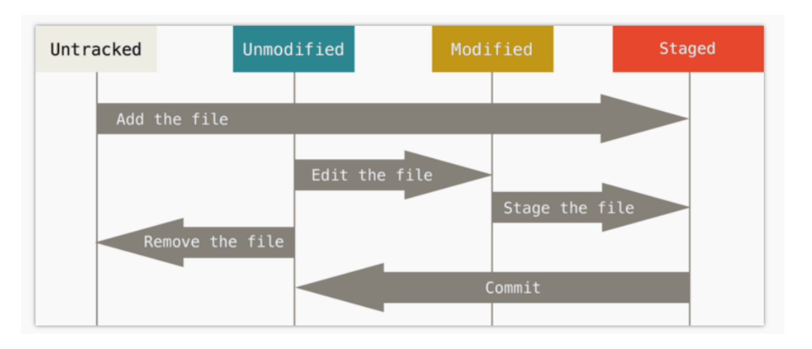

# 引言：Why Git？

* 当你已经开始用日期或版本号命名的代码文件时
* 当你需要在不同的电脑上同步自己的程序时
* 当你需要与其他人协作一起完成代码时

# Git 流程图

# Git的安装
## 下载安装（WIN）
从这里下载并安装就可以了: https://git-scm.com/download/win
直接运行EXE，疯狂下一步

## 初始化配置

运行刚做好的Git Bash
当我们要管理某个文件夹时，首先cd到该文件夹

    $ cd G:\Mypython

第一次需要添加用户名和用户邮箱

    $ git config --global user.name "Apple"
    $ git config --global user.email "kmwuhuihang@126.com"

## 创建版本库：init

    $ git init

## 直接从Github上同步程序

    $ git clone https://github.com/wuhuihangsufe/Python-Action-in-Finance.git
# Git的基本逻辑

# Git的常用代码

# 添加文件管理：add

如果库中有文件可以直接操作，如果没有就新加一个文件

    $ touch 1.py // 使用touch新建一个1.py的文件

使用add来将文件添加到版本库中管理

    $ git add 1.py // 仅添加1.py该文件

    $ git add . // 添加所有文件

# 查看版本库的状态:status

    $ git status

# 提交这次的改变:commit
    $ git commit -m "creat 1.py"

# 记录每一次code的修改：log & diff

在 git 中, 每一次提交(commit)的修改, 都会被单独的保存起来. 也可以说 git 的中的所有文件都是一次次修改累积起来的. 文件好比楼房, 每个 commit 记录了盖楼需添加或者拿走的材料. 整个施工过程也被记录了下来.

使用log来查看code修改的记录

    $ git log
    $ git log --oneline

以我们在1.py中添加一行代码a=1为例：
a=1

当我们需要查看到底1.py做了什么修改时，我们使用diff来查看unstated的修改部分和上个已经commit的文件的区别

    $ git diff

我们使用diff --cached来查看已经add了这次修改，变成stated的状态，但是没有commit时，比较该状态下修改部分和上个已经commit的文件的区别

    $ git diff --cached

当我们修改1.py时，我们需要完整的重复add和commit的操作来记录，这一次的修改完成

    $ git add 1.py
    $ git commit -m "第一次修改1.py"

以我们在1.py中添加另外一行代码b=2为例：

    b=2 #extra info

我们依然重复add和commit的操作来记录，这一次的修改完成

    $ git add 1.py
    $ git commit -m "第二次修改1.py"

# 回到上一个版本：reset

每个 commit 都有自己的 id 数字号, HEAD 是一个指针, 指引当前的状态是在哪个 commit. 最近的一次 commit 在最右边, 我们如果要回到过去, 就是让 HEAD 回到过去并 reset 此时的 HEAD 到过去的位置.

我们可以通过reset的操作来回到上一次commit状态
## 查看指针在哪里

    $ git reset --hard HEAD

## 回到上一次
    $ git reset --hard HEAD^

我们发现我们第二次修改消失了，这个时候我们后悔了，想找回来，通过reflog的操作来挽救

    $ git reflog
    $ git reset --hard 6ace7de

# 回到从前（针对单个文件而不是整个版本库）：checkout

之前我们使用 reset 的时候是针对整个版本库, 回到版本库的某个过去. 不过如果我们只想回到某个文件的过去, 又该怎么办呢?
其实 checkout 最主要的用途并不是让单个文件回到过去, 我们之后会继续讲 checkout 在分支 branch 中的应用, 这一节主要讲 checkout 让文件回到过去.

我们仅仅要对 1.py 进行回到过去操作, 回到 6f1b555  这一个 commit. 使用 checkout+ id c6762a1 + -- + 文件目录 1.py, 我们就能将 1.py 的指针 HEAD 放在这个时刻 6f1b555:、

    $ git checkout 6f1b555 -- 1.py

这个时候我们的第二次修改并没有消失，但是我们1.py已经回到了过去，这个时候我们可以重新add 并commit一遍完成修改

    $ git add 1.py
    $ git commit -m "这是穿越回过去的1.py然后又存了一次"
    $ git log --oneline

# 分支：branch 

很多时候我们需要给自己或者客户用一个稳定的版本库, 然后同时还在开发另外一个升级版. 自然而然, 我们会想到把这两者分开处理, 用户使用稳定版, 我们开发我们的开发版. 不过 git 的做法却不一样, 它把这两者融合成了一个文件, 使用不同的分支来管理. 所以这一节我们来说说 git 中的 分支 Branch

## 查看分支

    $ git log --oneline --graph

## 建立分支：branch

我们可以通过branch的操作来回建立分支1：dev

    $ git branch dev
    $ git branch

我们可以通过checkout的操作来把HEAD切换到分支dev

    $ git checkout dev
    $ git branch

## 使用 checkout -b + 分支名, 就能直接创建和切换到新建的分支
    $ git checkout -b dev

将分支的改变合并到master中：branch

此时
因为当前的指针 HEAD 在 dev分支上, 所以现在对文件夹中的文件进行修改将不会影响到 master 分支.

我们在 1.py 上加入这一行 # I was changed in dev branch, 然后再 commit:

    $ git commit -am “分支dev中第一次修改” //"-am": add 所有改变 并直接 commit

好了, 我们的开发板 dev 已经更新好了, 我们要将 dev 中的修改推送到 master 中, 大家就能使用到正式版中的新功能了.
首先我们要切换到 master, 再将 dev 推送过来.

    $ git checkout master 
    $ git merge dev
    $ git log --oneline --graph

要注意的是, 如果直接 git merge dev, git 会采用默认的 Fast forward 格式进行 merge, 这样 merge 的这次操作不会有 commit 信息. log 中也不会有分支的图案. 我们可以采取 --no-ff 这种方式保留 merge 的 commit 信息.

    $ git merge --no--ff -m "keep merge info" dev
    $ git log --oneline --graph

# 使用Github在线代码管理:push & pull

在Github上新建一个repository，然后使用下面的命令将本地文件库上传

    $ git remote add origin https://github.com/wuhuihangsufe/git-test.git
    $ git push -u origin master
    $ git push -u origin dev

如果在本地再进行修改, 比如在 1.py 文件中加上 # happy github, 然后 commit 并推上去:

    $ git commit -am "测试github的修改"
    $ git push -u origin master

如果在github上再进行修改, 比如在 1.py 文件中加上 # change in github, 然后需要同步到本地:

    $ git pull origin master

克隆一份代码到本地

    $ git clone https://github.com/wuhuihangsufe/git-test.git
    $ git remote add upstream #保持同步

# 参考资料：
* 官方手册见：https://git-scm.com/book/zh/v2
* 莫烦Python：https://morvanzhou.github.io/tutorials/others/git/1-2-install/
* Git官网：https://git-scm.com/

